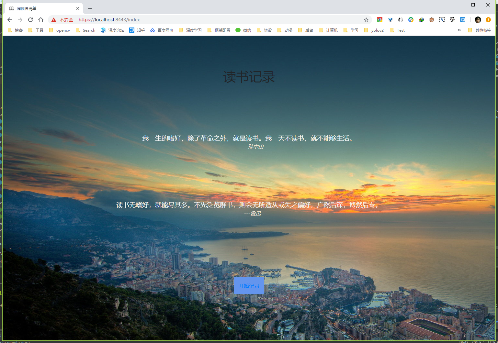
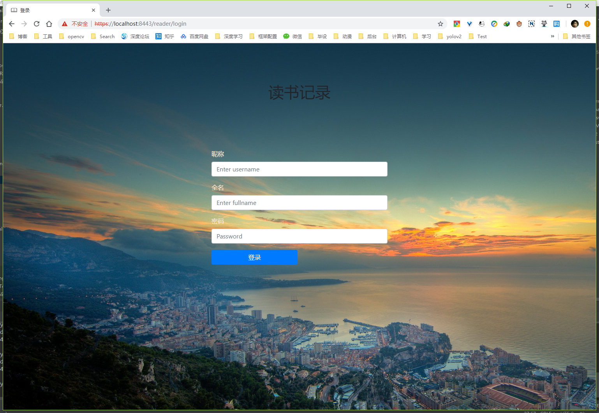
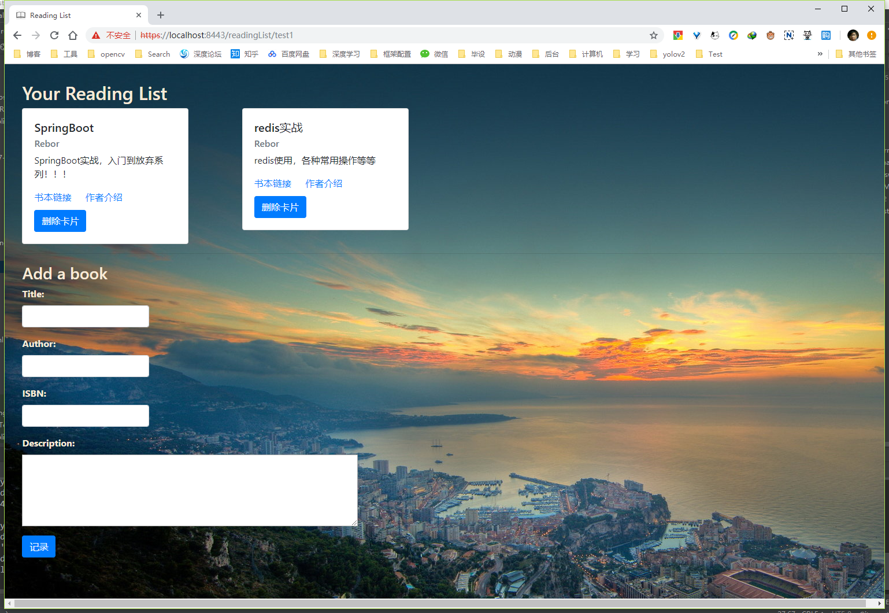

# ReadingList
采用SpringBoot2+gradle+Thymeleaf构建一个读书清单记录。

## 前言

提样一下Java后端渲染前端页面，采用springboot2中推荐使用thymeleaf模板引擎。简单写了一个读书清单记录，很简陋，主要实现登录注册，读书记录功能，界面没怎么调，全用Bootstrap的组件。

## 界面展示

首页

登录注册：

读书记录页：

